  

Technical Program Manager and full-stack builder with ~20 years in mortgage and financial services technology. I ship end-to-end — from backend APIs and databases to mobile apps and AI-powered tools. Currently job hunting in Houston, TX while building independently on the side.

> 🔭 **Currently building:** [AI Transparent Notes V2](https://github.com/danhino/ai-transparent-notes-v2)

---

### 📝 AI Transparent Notes V2

> **A true OS-level transparent notes app for Windows, built with AI writing tools baked in.**

| Layer | Tech |
|---|---|
| 🖥️ Desktop Shell | Tauri 2.0 |
| ⚛️ UI | React 19 + TypeScript |
| 🎨 Editing | Multi-pane, up to 8 tabs, CodeMirror 6 syntax highlighting for 15+ languages |
| 🤖 AI Tools | Contextual writing assistance and format toolbars |
| 📦 Distribution | NSIS `.exe` and `.msi` installers |

🔗 **[github.com/danhino/ai-transparent-notes-v2](https://github.com/danhino/ai-transparent-notes-v2)**

--

### 🛠️ Fuerza Home Services

> **A bilingual marketplace app connecting homeowners with trade professionals across six service categories.**

| Layer | Tech |
|---|---|
| 📱 App | React Native + Expo Router |
| ⚙️ Backend | Node.js, Express, TypeScript |
| 🗄️ Data | Prisma + PostgreSQL |
| 🔄 Realtime | Socket.io, Zustand |
| 💳 Payments | Stripe PaymentSheet + Connect Express |
| ☁️ Storage | Cloudflare R2 |
| 🔔 Notifications | Firebase Admin SDK |
| 🌐 i18n | Bilingual English + Spanish |

🔗 **[github.com/danhino/fuerza-home-services](https://github.com/danhino/fuerza-home-services)**

--

### ☀️ 100 Miles of Summer

> **A PWA-ready fitness tracker to log and gamify a summer running goal — no framework, no backend, no cost.**

| Layer | Tech |
|---|---|
| 🏗️ Structure | HTML5 semantic markup |
| 🎨 Styling | CSS3, responsive dark mode via `@media prefers-color-scheme` |
| ⚡ Logic | Vanilla JavaScript, no frameworks |
| 📊 Charts | Chart.js — activity breakdown visualization |
| 💾 Storage | Browser `localStorage` — offline-first, data stays on device |
| 📤 Export | `Blob` + `FileReader` APIs — JSON import/export for backups |
| 🌐 Hosting | GitHub Pages |

🔗 **[github.com/danhino/100-miles-of-summer](https://danhino.github.io/100-miles-tracker/100-miles-tracker.html)**

--

### 🤖 AI Resume Agent

> **A chatbot that answers questions about my professional background, deployed as both a full page and a floating widget on my portfolio.**

| Layer | Tech |
|---|---|
| 🌐 Proxy | Cloudflare Worker |
| 🔒 Security | CORS lock + IP-based rate limiting via KV |
| 🧠 System Prompt | Embedded professional profile context |

🔗 **[danhino.com](https://danhino.com)**

--

### 🏥 AI Claims Processor

> **An AI-driven claims intake system built for Family First ER, reducing triage time from 1–2 days to under 90 seconds.**

🔗 **[github.com/danhino/ai-claims-processor](https://github.com/danhino/ai-claims-processor)**

---

## ⚙️ Tech Stack

**Languages & Frameworks**

**AI & Agents**

**Mobile & Desktop**

**Infrastructure**

---

## 🧬 What I Build

🤖 **AI-powered tools** — desktop apps with embedded AI writing assistants, AI chatbots, automated claims processing

📱 **Mobile marketplace apps** — bilingual, payment-integrated, with realtime backends

🌐 **Personal AI agents** — resume agents, portfolio chat widgets, Cloudflare-deployed proxies

🚀 **Full-stack delivery** — solo, from database schema to mobile UI to deployment

---

## 🔗 Connect

